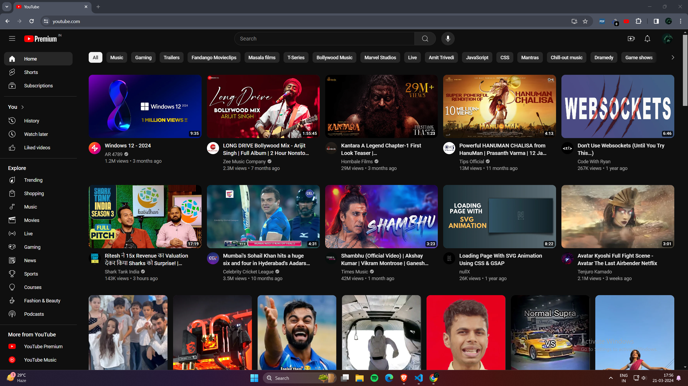

# YouTube Premium Badge

A lightweight browser extension that swaps the standard YouTube logo with a sleek Premium badge — making your interface look upgraded without paying a dime.



---

## Getting Started

### Prerequisites
- Google Chrome, Brave, or any Chromium-based browser

### Installation

1. **Grab the code** — Download as ZIP or clone the repo:
   ```
   git clone https://github.com/shresth/youtube-premium-badge.git
   ```
2. **Unzip** the downloaded archive to any folder on your machine.
3. **Open your browser** and head to the extensions page:
   - Type `chrome://extensions` in the address bar
4. **Flip the switch** — Enable **Developer Mode** (top-right toggle).
5. **Load it up** — Click **Load unpacked** (top-left), then pick the folder you just unzipped.
6. **Done** — The extension icon appears in your toolbar. Head to YouTube and hit refresh (`Ctrl+R` / `Cmd+R`) to see the Premium badge.

---

## Contributing

Fork it, tweak it, ship it. Pull requests are always welcome.

1. Fork the repo
2. Create a feature branch
3. Commit with clear messages
4. Push and open a PR

---

## Author

Built by **Shresth** — [shresthdesign.vercel.app](https://shresthdesign.vercel.app)

---

## License

This project is provided as-is for personal and commercial use. Attribution is appreciated but not required.
